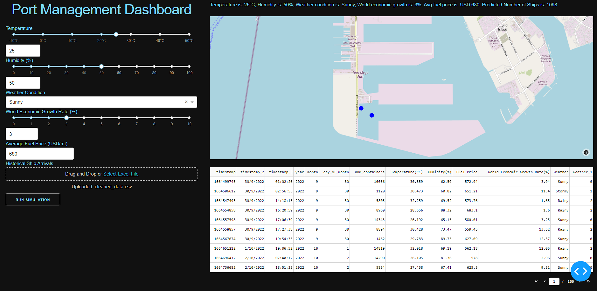
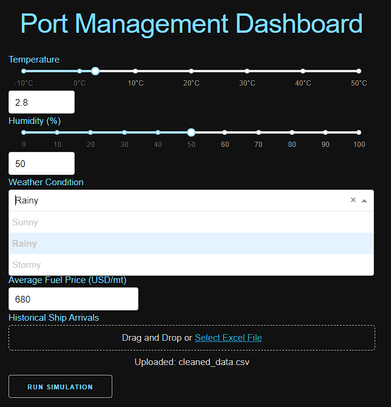
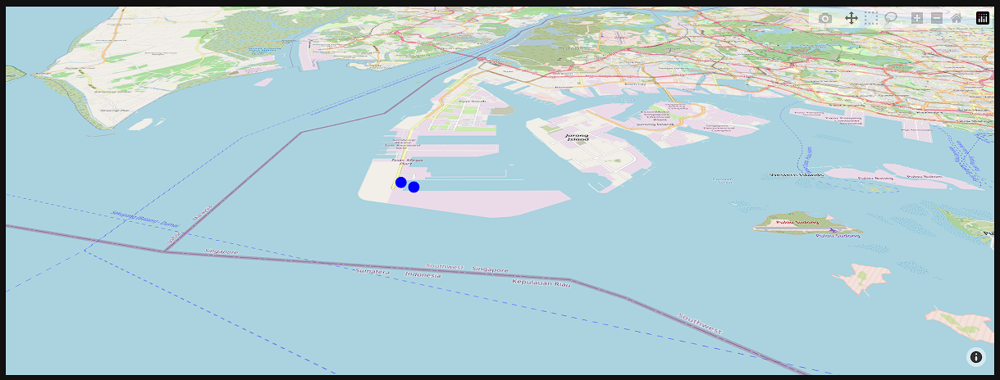

# PSA Code Sprint 2023

Problem Theme 1: Towards a highly resilient Port Ecosystem

Demand-supply management within the container port ecosystem is crucial for its efficiency. Firstly, forecasting demand is essential, considering factors like shipping schedules, trade fluctuations, and seasonal variations. Secondly, managing the supply of available berths and terminal facilities is vital to handle incoming vessels and cargo. Thirdly, optimizing the allocation of resources, such as cranes and handling equipment, ensures smooth operations. Effective demand-supply management helps reduce congestion, minimize vessel waiting times, maximize asset utilization and enhance the overall throughput of the port. Striking the right balance between supply and demand is pivotal in maintaining the productivity and competitiveness of container ports.
​
How can digital solutions powered by data and AI optimize demand and supply to increase resilience of the port amidst global disruptions and risks?

---
## Our Solution: PortSimulAtor
Link to our youtube video: https://www.youtube.com/watch?v=gXX4y-lyJvY

An AI-powered simulation software that empowers PSA to forecast the impact of trade fluctuations, seasonal variations and external disruptions on the usage of port resources such as supply-chain logistics and power consumption to build a more resilient, future-proof and sustainable port.

- PSA Singapore is a major global port operator with an extensive network of maritime interconnections.
- Given the volatile nature of the maritime industry and the increasing frequency of trade disruptions such as pandemics, weather disruptions, global economic factors, PSA is expected to experience greater trade fluctuations that may pose a threat to its currently thriving status in Singapore
- Hence, it is imperative that PSA remains future-oriented by forecasting the impacts of potential trade disruptions, in order to stay one step ahead and to prepare for such disruptions, in terms of smart logistics management and sustainable operation.







We utilized Dash to create a dynamic dashboard to run port simulations.
- Users can adjust parameters to introduce trade disruptions into the simulation. Some examples:
  - Weather: Temperature Humidity
  - Trade factors: Global economic growth
- The dashboard reacts in real-time based on the chosen parameters of user’s simulation
- Users can then initiate a comprehensive AI-powered Port Simulator that factors in all the adjusted parameters to provide a detailed forecast of the utilization of the port’s resources such as distribution logistics and energy consumption.

Agent-Based Modelling (ABM)
- Different elements of a port (ships, cranes, AGV vehicles, storage units, charging stations) are modelled as different agents of ABM
- Simulations consisting of multiple agents are run to analyse the interactions between different agents based on the introduced disruption
- A set of complex pseudo-deterministic instructions are set to model realistic behaviours of port agents and their interactions with other agents of the port
- User can introduce disruptions into the simulation (e.g., natural disasters, trade fluctuations)

Gated Recurrent Unit (GRU), Recurrent Neural Network
- GRU captures short and long term trends to make predictions.
- Large sets of historical data are used to train a GRU model to forecast the demand port resources based on selected disruptions

###  Future Plans

- Enhance the reliability of the model via providing more data sets and refining the mathematical model that structures the simulation
- Introduce more agents and expand the network of connections to be more inclusive of other port elements involved in PSA’s operations, thus leading  more realistic port simulations

---
### Set up environment

Installing [Anaconda](https://www.anaconda.com/) to manage the environment is recommended. Use the `environment.yml` file to set up the conda environment.

To recreate the environment
```
conda env create -f environment.yml
```

Activate the environment with
```
conda activate my_env
```

Switch to the new environment 
```
conda activate psa-code-sprint-env
```

Your local environment should be set up.

### Set up app

Run the app, and open it in your browser.
```
python src\app.py
```

---
### Remarks

This is still a prototype that is semi-functional, our machine learning models have not been integrated into our app.
